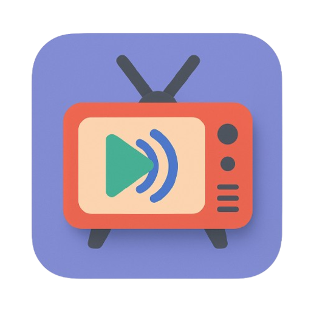

# Dhara TV




## Overview

Dhara TV is a modern streaming application built with Electron that allows users to watch live TV channels from various sources. The application supports custom playlists and provides a user-friendly interface for browsing and watching channels.
> ⚠️ **AI-Generated Code Warning:** This repository contains code that was generated by AI. While efforts have been made to verify accuracy and functionality, please review and test code independently before using it in production environments.


## Features

- **Live TV Streaming**: Watch live TV channels directly within the application
- **Channel Categories**: Browse channels organized by categories
- **Search Functionality**: Quickly find channels using the search feature
- **Favorites System**: Mark and access your favorite channels easily
- **Custom Playlists**: Add your own M3U playlist URLs
- **Responsive Design**: Works on various screen sizes
- **Cross-Platform**: Available for Windows, macOS, and Linux

## Installation

### Prerequisites

- [Node.js](https://nodejs.org/) (v14 or later)
- npm (included with Node.js)

### Installation Steps

1. Clone the repository:
   ```
   git clone https://github.com/yourusername/dhara-tv.git
   cd dhara-tv
   ```

2. Install dependencies:
   ```
   npm install
   ```

3. Start the application:
   ```
   npm start
   ```

## Building from Source

Dhara TV can be built for different platforms:

- **Windows**:
  ```
  npm run build:win
  ```

- **macOS**:
  ```
  npm run build:mac
  ```

- **Linux**:
  ```
  npm run build:linux
  ```

Built packages will be available in the `dist` directory.

## Using the Application

1. **Browsing Channels**: All available channels are listed in the sidebar
2. **Playing Content**: Click on a channel to start streaming
3. **Searching**: Use the search bar to find specific channels
4. **Favorites**: Click the heart icon to add channels to your favorites
5. **Custom Playlists**: Add custom playlist URLs in the Settings panel

## Configuration

You can customize the application through the Settings panel:

1. Click the gear icon in the top-right corner
2. Enter a custom M3U playlist URL
3. Save your changes

### File Format for m3u8
Encrypted stream
```
#EXTINF:-1 group-title="LIVE" tvg-chno="" tvg-id="" tvg-logo="https://example.com/logo.png", Name
#EXTVLCOPT:http-user-agent=chrome (Linux;Android 14) AndroidXMedia3/1.1.1/64103898/4d2ec9b8c7534adc
#EXTHTTP:{"cookie":"Edge-Cache-Cookie=URLPrefix=https://example-cdn.com/:Expires=9999999999:KeyName=demo_key:Signature=example_signature"}
https://example.com/stream/playlist.m3u8
```
Public stream
```
#EXTINF:-1 group-title="LIVE" tvg-chno="" tvg-id="" tvg-logo="https://example.com/logo.png", Name
https://example.com/stream/playlist.m3u8
```
## Development

### Project Structure

- `main.js` - Electron main process
- `app.js` - Application logic
- `index.html` - Main application UI
- `css/styles.css` - Application styling

### Technologies Used

- [Electron](https://www.electronjs.org/) - Cross-platform desktop app framework
- [Plyr](https://plyr.io/) - HTML5 media player
- [HLS.js](https://github.com/video-dev/hls.js/) - HTTP Live Streaming client
- [Font Awesome](https://fontawesome.com/) - Icon toolkit

## Acknowledgments

- **Plyr**: Custom HTML5, YouTube and Vimeo media player by Sam Potts
- **HLS.js**: Video.js library for HLS playback
- **Font Awesome**: Icon toolkit by Fonticons, Inc.
- **Electron**: Cross-platform desktop apps framework by GitHub
- **[mahdirdrmc](https://github.com/mahdirdrmc/dhara-streaming/)**: Main Project Idea

## License

This project is licensed under the MIT License - see the LICENSE file for details.

## Support and Contribution

Contributions, issues, and feature requests are welcome! Feel free to check the issues page.

---
